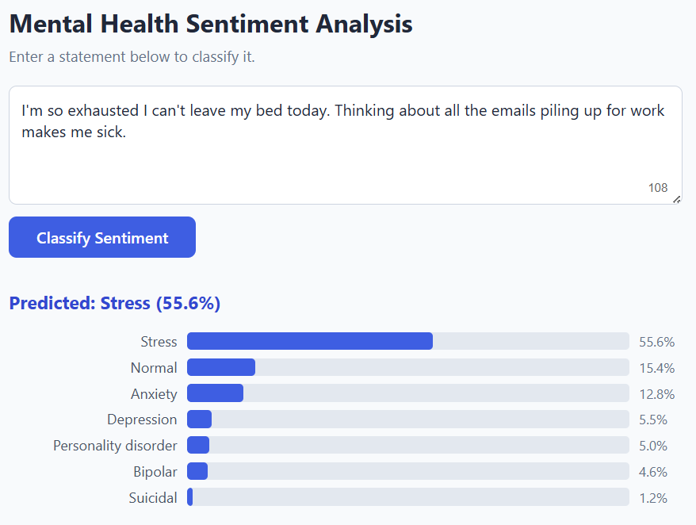
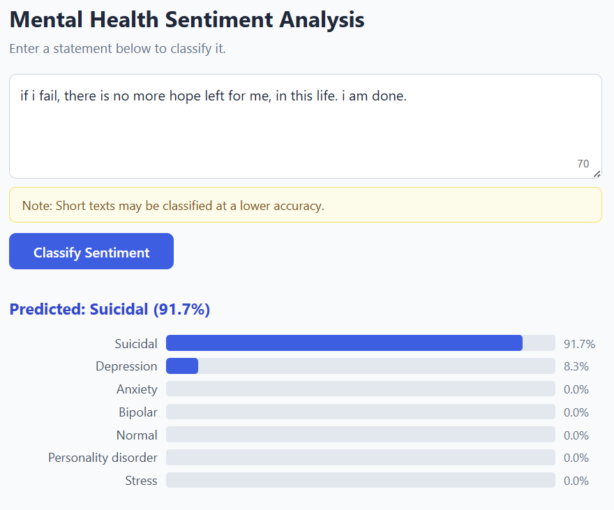
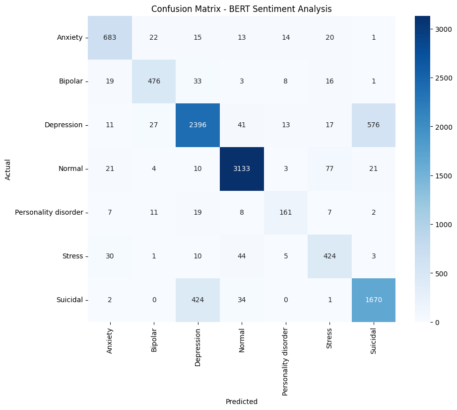
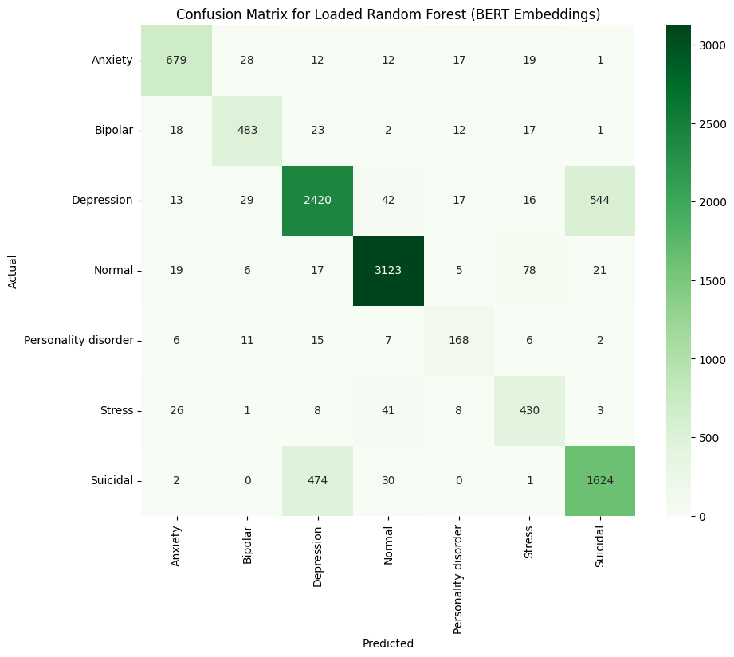

# Mental Health Sentiment Analysis

> Hybrid BERT + Random Forest pipeline for automated mental health triage, classifying text into 7 psychological states at ~85% accuracy. Web app included.


[](https://jaukg9.github.io/mental-health-sentiment-analysis)

---

## Demos

  
*Stress Classification: The model correctly identifies stressed ideation with 55.6% confidence*

  
*Suicidal Classification: The model correctly identifies suicidal ideation with 91.7% confidence*

---

## Overview

As more people turn to social media and online platforms when experiencing psychological distress, for both interaction with others and to seek support, the bottleneck preventing accurate and efficient triaging of mental health issues becomes increasingly prominent. This project addresses that bottleneck with an automated NLP classifier that categorizes raw user text into one of seven psychological states. The core design challenge, and contribution, was balancing classification accuracy against computational efficiency, such that the system can realistically scale to high concurrent user volumes without prohibitive latency.

Read the full paper: *Soon to be published*

---

## Architecture

The pipeline is built on a deliberate two-stage hybrid design

1. A fine-tuned BERT model reads the input and compresses it into a 768-dimensional embedding, a dense numerical vector that captures deep contextual and semantic relationships within the text.
2. The 768-dimensional vector is handed off to a lightweight **Random Forest classifier**, which produces the final category prediction along with probability scores for each mental health status.

The design intentionally did not use BERT end-to-end for the final classification, as it introduces significant latency, making it unsuitable for real-world deployment. By fixing BERT as a static feature extractor and letting Random Forest make the actual prediction, accuracy is preserved while making the system orders of magnitude cheaper to run.

```
Raw Text → BERT → 768-Dimensional Embedding → Random Forest → Predicted Class & Probabilites
```

---

## Dataset

This project uses the [**Sentiment Analysis for Mental Health**](https://www.kaggle.com/datasets/suchintikasarkar/sentiment-analysis-for-mental-health) dataset compiled by Suchintika Sarkar on Kaggle (2024). It contains `53,043` raw text samples sourced from Reddit, Twitter, and other social media platforms, representing authentic digital expressions of psychological distress.

Each sample is labeled with one of seven mutually exclusive classes:  
| Label                 | Description                               | Prevalence |
| --------------------- | ----------------------------------------- | ---------- |
| Normal                | No clinical indicators present            | 31.0%      |
| Depression            | Depressive language and thought patterns  | 29.2%      |
| Suicidal              | Suicidal ideation or intent               | 20.2%      |
| Anxiety               | Anxiety-related distress                  | 7.3%       |
| Bipolar               | Bipolar-related language patterns         | 5.3%       |
| Stress                | Stress and overload indicators            | 4.9%       |
| Personality Disorder  | Personality disorder indicators           | 2.0%       |

The dataset has a notable class imbalance, with Normal (~31%) and Depression (~29%) making up most of the dataset, and specialized clinical conditions representing a much smaller fraction. Stratified sampling was used to preserve these proportions across an 80/20 train-test split, ensuring the model was evaluated against a realistic class distribution.

---

## Results

| Model         | Test Accuracy | Visualization             |
| ------------- | ------------- | ------------------------- |
| BERT Model    | 84.87%        | [BERT Confusion Matrix](#bert-model-confusion-matrix)  |
| Hybrid System | 84.72%        | [Hybrid Confusion Matrix](#hybrid-model-confusion-matrix) |

#### BERT Model Confusion Matrix

*The model achieves 84.87% accuracy on the test set, with the only significant class confusion coming from the comorbid statuses of `Depression` and `Suicidal`*

#### Hybrid Model Confusion Matrix

*The Random Forest trained on BERT embeddings achieves 84.72% accuracy on the test set. Similar to the BERT interface, the only significant class confusion comes from the comorbid statuses of `Depression` and `Suicidal`*

The deployed hybrid system, consisting of the Random Forest trained on BERT embeddings, achieves 84.72% accuracy, only a 0.15% accuracy drop compared to the pure BERT interface, while significantly reducing inference latency. The emost common misclassifications for both models occur between `Depression` and `Suicidal`, suggesting that the linguistic patterns between these two classes are inherently similar, consistent with teh established psychiatric literature on the comorbidity of depressive and suicidal states.

#### Edge Case Performance
To evaluate the boundary limitations and pragmatic capabilities of hybrid system, a qualitative edge-case analysis was performed. Five distinct linguistic scenarios consisting of various biases, were manually curated and evaluated.

| Edge Case | Input | Result | Notes |
| --------- | ----- | ------ | ----- |
| Hyperbolic | This math test is going to end me. | Normal (98%) | Correctly ignores the key phrase "end me" in casual context |
| Idiomatic | I am absolutely killing it at my new job! | Depression (36%) | Incorectly misconstrues "killing" in a negative context |
| Sarcastic | Oh great, another massive panic attack at 3 AM. I am absolutely loving my life right now, truly living the dream. | Stress (25%) | Correctly overlooks sarcastic language, such as "great" and "loving" |
| Temporal | Two years ago, I was profoundly depressed and had constant suicidal thoughts, but thankfully I got professional help and today I feel incredibly happy, healthy, and full of life. | Normal (64%) | Correctly parses the chronological arc rather than flagging early, negative tokens |
| Minimized | I don’t mean to bother anyone, and I know everyone here has much bigger problems than me, but I’ve been feeling a bit empty lately. Sorry for wasting your time. | Stress (61%) | Incorrectly construes apologetic, self-diminishing language as stress instead of depression |

---

## Installation & Setup
**Dependencies:** Python 3.9+, PyTorch, Hugging Face Transformers, Scikit-learn, Gradio.

```bash
git clone https://github.com/JaukG9/mental-health-sentiment-analysis.git
cd mental-health-sentiment-analysis
pip install -r app/requirements.txt
```

> **Note:** The fine-tuned BERT model weights are hosted on Hugging Face and are downloaded automatically on first run. A GPU is recommended for faster BERT inference but is not required.

To launch the app locally:
```bash
python app/app.py
```
The app is also hosted on [**Github Pages**](https://jaukg9.github.io/mental-health-sentiment-analysis) and [**Hugging Face Spaces**](https://huggingface.co/spaces/AyaanGos/mental-health-sentiment-analysis) and can be used directly without any local setup.

---

## Usage

This app accepts raw, unstructured text and returns a predicted psychological state along with probability scores across all seven classes. Three primary use cases are:
- **Self-reflection:** Paste a personal journal entry or daily log to get a snapshot of your current psychological state. Track how your prediction probabilities shift over time to identify recurring emotional patterns
- **Content moderation:** Platform moderators can input flagged posts to quickly assess severity and prioritize cases that require immediate intervention, particularly those classified as `Suicidal` or `Depression`
- **Clinical pre-screening:** Before a telehealth session, a patient can submit a brief description of their current mental state, giving the clinician a baseline label and full probability breakdown to tailor their initial line of questioning

---

## Limitations

- **Demographic bias:** Training data is sourced mostly from Reddit and Twitter, skewing the model toward younger, internet-literate populations. Accuracy may degrade on older demographics or non-digital communication styles such as spoken transcripts
- **Single-label output:** The model assigns one class per input, but real clinical conditions are frequently comorbid. The displayed probability scores partially compensate by surfacing secondary signals, but this does not replace a proper multi-label framework
- **Figurative language:** The model struggles with idioms, heavy sarcasm, and minimized distress phrasing, sometimes over-indexing on the literal weight of individual keywords rather than the overall pragmatic intent of the text
- **Not a diagnostic tool:** This system is designed as a triage aid and early-warning mechanism. It should be used to *inform* professional evaluation, not replace it

---

## Future Work

- Transition to a multi-label classification architecture to better reflect the comorbid reality of overlapping clinical conditions
- Apply knowledge distillation or weight quantization to reduce BERT's computational footprint, lowering inference latency and cloud hosting costs
- Expand training data beyond social media text to include verbal and non-digital modalities, reducing demographic bias and improving generalization across broader populations

---

## Citation

If you use this project or build on it, please cite the paper and dataset:

**Paper**
```
To be published
```

**Dataset**
```
Sarkar, S. (2024). Sentiment Analysis for Mental Health. Kaggle.
https://www.kaggle.com/datasets/suchintikasarkar/sentiment-analysis-for-mental-health/data
```

---

*This tool is intended for research and informational purposes only. It is not a medical device and should not be used as a substitute for professional mental health care.*
