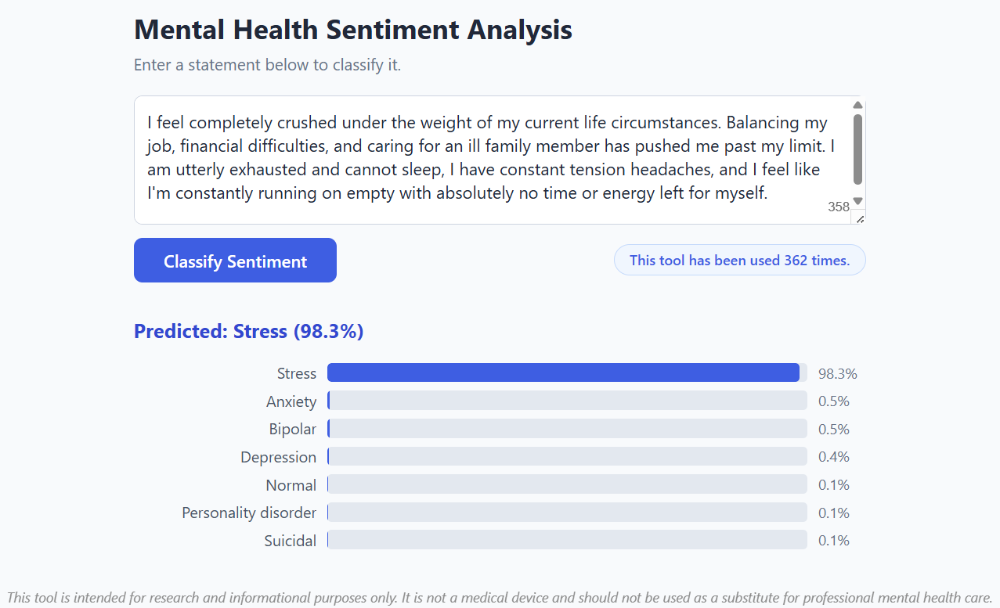
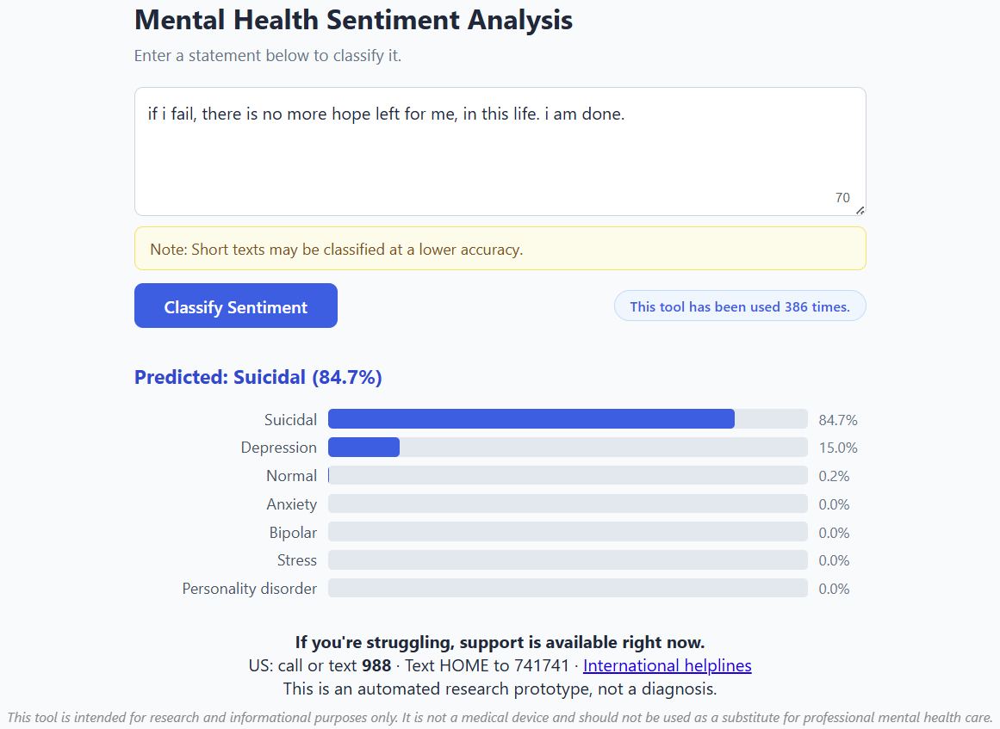
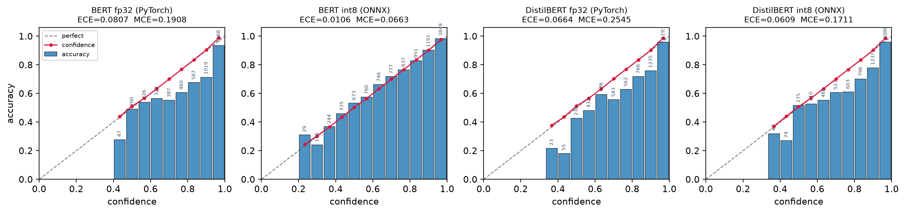

# Mental Health Sentiment Analysis

> A staged optimization study for automated mental health text triage: from a fine-tuned BERT reference model down to a quantized, ONNX-runtime DistilBERT that runs 4.3x faster and 6.4x smaller, at 82.3% accuracy across 7 psychological states. Web app included.


[](https://jaukg9.github.io/mental-health-sentiment-analysis)

---

## Demos



*Stress Classification: the deployed model flags stress-related distress and surfaces a probability breakdown across all seven classes.*



*Suicidal Classification: high-risk results additionally display crisis resources, shown whenever the model assigns at least 25% probability to the Suicidal class.*

---

## Overview

As more people turn to social media and online platforms when experiencing psychological distress, the volume of disclosure increasingly outpaces the capacity of moderators and clinicians to review it. This project addresses that bottleneck with an automated NLP classifier that categorizes raw user text into one of seven psychological states, deployed as a lightweight web application.

Rather than treating efficiency as an afterthought, this project frames deployment itself as an optimization problem across four independent axes: the classification head, the encoder, the inference runtime, and the numeric precision of the model's weights. Each axis was varied and measured separately so its contribution to speed, size, and accuracy could be individually attributed, including the axes that turned out not to help.

Read the full paper: *Precision versus Efficiency: A Quantized DistilBERT Framework for Automated Mental Health Text Triage* (Ayaan Goswami, Clayton Greenberg - submitted to IJSCAR, currently under review)

---

## Architecture

The deployed system replaces BERT's encoder with a distilled, quantized alternative served through ONNX Runtime:

```
Raw Text → DistilBERT Encoder (int8, ONNX Runtime) → Native Classification Head → Predicted Class & Probabilities
```

An earlier version of this project used BERT as a static feature extractor feeding a Random Forest classifier. That design was abandoned. Because every input still has to pass through the full encoder to produce its embedding regardless of what sits downstream, swapping a linear layer for 300 decision trees added inference cost rather than removing it, while leaving accuracy essentially unchanged (0.8300 vs. 0.8312, and 1.67 points lower Suicidal recall). Therefore, inference cost on this task is dominated by the encoder, not the classification head, so all further optimization was directed there.

Two remaining axes did pay off:
- **Encoder**: distilling BERT down to DistilBERT roughly halves latency for a small accuracy cost.
- **Numeric precision**: quantizing the encoder to 8-bit integers roughly halves latency again.

Exporting to ONNX Runtime is numerically lossless and contributes only 5–9% of the total speedup on its own, but the real gains come from distillation and quantization.

---

## Dataset

This project uses the [**Sentiment Analysis for Mental Health**](https://www.kaggle.com/datasets/suchintikasarkar/sentiment-analysis-for-mental-health) dataset compiled by Suchintika Sarkar on Kaggle (2024): 53,043 raw text samples aggregated from nine independently collected and labeled datasets sourced from Reddit, Twitter, and other social platforms.

Each sample is labeled with one of seven mutually exclusive classes:

| Label                 | Description                               | Prevalence |
| --------------------- | ----------------------------------------- | ---------- |
| Normal                | No clinical indicators present            | 31.0%      |
| Depression            | Depressive language and thought patterns  | 29.2%      |
| Suicidal              | Suicidal ideation or intent               | 20.2%      |
| Anxiety               | Anxiety-related distress                  | 7.3%       |
| Bipolar               | Bipolar-related language patterns         | 5.3%       |
| Stress                | Stress and overload indicators            | 4.9%       |
| Personality Disorder  | Personality disorder indicators           | 2.0%       |

Because the source datasets were scraped and labeled independently under different schemes with no unified annotation pass, the labels indicate the category under which a statement was originally collected, not a clinical assessment. Stratified sampling preserved these proportions across an 80/20 train-test split.

### Corpus quality audit

Because the corpus is an aggregation of independently collected sources, it was audited before any model was trained:

- **Duplication**: 3.27% of rows are exact duplicates after normalization.
- **Label conflicts**: 30 statements (2.06% of repeats) carry conflicting labels across 78 rows, 57% of which are Depression/Suicidal disagreements, consistent with the known clinical comorbidity of the two.
- **Train/test leakage**: 5.87% of the test set overlaps with training data (exact or near-duplicate), concentrated disproportionately in the smallest classes. The safety-critical Suicidal class is the least leaked at 1.83%.

All reported results are computed on a leakage-filtered test set (9,919 samples), with full-set figures given alongside for comparability with prior work. Removing leaked rows lowers accuracy by only ~0.3–0.5 points but lowers macro-F1 by ~1.5–2 points, roughly 4–5x the effect, since leakage concentrates in minority classes that macro-F1 weights more heavily than overall accuracy.

---

## Results

### Model selection criterion

Configurations were compared against a fine-tuned BERT fp32 reference using the [MLPerf Inference](https://doi.org/10.1109/ISCA45697.2020.00045) tolerance: an optimized model must retain **at least 99% of reference accuracy and 99% of reference Suicidal recall**. Among configurations clearing both bars, the fastest was deployed.

| Configuration              | Accuracy | Macro-F1 | Suicidal Recall | ms/req | req/s | Size (MB) |
| --------------------------- | -------- | -------- | ---------------- | ------ | ----- | --------- |
| BoW + logistic regression   | 0.7608   | 0.6841   | 0.6711            | 0.84   | 9694.9 | 4.2       |
| TF-IDF + logistic regression | 0.7758   | 0.6883   | 0.6788            | 0.98   | 9055.9 | 4.6       |
| BERT fp32, PyTorch (reference) | 0.8312 | 0.7964   | 0.7132            | 186.4  | 3.8   | 438.7     |
| BERT int8, ONNX Runtime     | 0.8007   | 0.7406   | 0.7787            | 84.4   | 7.0   | 111.4     |
| DistilBERT fp32, PyTorch    | 0.8206   | 0.7839   | 0.7424            | 93.2   | 7.5   | 268.8     |
| **DistilBERT int8, ONNX Runtime (deployed)** | **0.8231** | **0.7876** | **0.7103** | **43.8** | **13.1** | **68.3** |

The deployed model reaches 99.02% of reference accuracy and 99.60% of reference Suicidal recall, clearing both thresholds, but narrowly: a paired bootstrap places the true accuracy ratio's 95% CI at [98.31%, 99.74%], so the separation from the unquantized DistilBERT configuration should not be treated as firmly established.

This is a genuine tradeoff, stated plainly: the deployed model is not the safest configuration available. Unquantized DistilBERT and quantized BERT both miss fewer suicidal statements. The deployed model was chosen because it clears the accuracy/recall bar at less than half the inference cost of any other configuration that also clears it, a defensible tradeoff for a prototype on limited compute, but one worth knowing before relying on it.

### Per-class performance (deployed model, leakage-filtered test set, n=9,919)

| Class                 | Precision | Recall | F1     | Support |
| ---------------------- | --------- | ------ | ------ | ------- |
| Anxiety                | 0.8342    | 0.8873 | 0.8599 | 692     |
| Bipolar                | 0.8416    | 0.8105 | 0.8257 | 459     |
| Depression             | 0.7766    | 0.7665 | 0.7715 | 2947    |
| Normal                 | 0.9479    | 0.9612 | 0.9545 | 3144    |
| Personality disorder   | 0.7000    | 0.6522 | 0.6752 | 161     |
| Stress                 | 0.6986    | 0.7217 | 0.7100 | 424     |
| Suicidal               | 0.7228    | 0.7103 | 0.7165 | 2092    |
| **Macro average**      | **0.7888**| **0.7871** | **0.7876** | 9919 |
| **Accuracy**           |           |        | **0.8231** | 9919 |

The most common confusion is between Depression and Suicidal, unsurprising given that pair accounts for the majority of label conflicts in the corpus itself, suggesting some of the confusion reflects inconsistent supervision rather than model error.

**Against frequency baselines**: the transformer buys 4.7 points of accuracy and 9.9 points of macro-F1 over the best TF-IDF baseline, at ~45x the latency and ~15x the size, with the gap widest on the minority classes (Personality disorder: 0.68 vs. 0.51 F1; Stress: 0.71 vs. 0.44 F1).

### Per-class effects of quantization

Quantizing BERT to int8 costs 3.05 points of overall accuracy, but that loss is not evenly distributed: Personality disorder F1 drops by 0.129 and Stress by 0.122, while Suicidal recall actually *rises* (0.7132 → 0.7787) as quantization noise shifts the Depression/Suicidal boundary toward the higher-risk class. Quantizing DistilBERT, by contrast, leaves per-class F1 essentially unchanged, the exception being a drop in Suicidal recall (0.7424 → 0.7103), offset by a rise in precision. Quantization is not uniformly safe, and its cost depends heavily on which encoder it's applied to.

### Edge-case pragmatics

An externally authored suite of 50 probes (10 each for hyperbole, idiom, sarcasm, temporal blindness, and minimized distress, written and frozen before any item was run) shows the deployed model handles overt exaggeration well (80% correct on hyperbole) and minimized distress okay (60% corret) but struggles badly with other language: 40% on idiom, 30% on sarcasm, 30% on temporal blindness. Of 26 misclassified probes, 20 were assigned to Normal and none to Suicidal. The model under-reacts to this type of language rather than over-escalating. All three probes whose intended label was Suicidal were missed, two of them at high confidence (>0.9) toward Normal. This is the clearest limitation of the deployed system and is why it is positioned as a prioritization tool for human review, not a filter.

### Calibration

Every configuration is overconfident (displayed confidence exceeds observed accuracy across most of the range). The deployed model assigns ≥99% confidence to 38.2% of predictions while being correct on 82% overall, though it never displays exactly 100% confidence (max observed: 99.92%).



---

## Installation & Setup

**Dependencies:** Python 3.9+, Hugging Face Transformers, ONNX Runtime, Gradio.

```bash
git clone https://github.com/JaukG9/mental-health-sentiment-analysis.git
cd mental-health-sentiment-analysis
pip install -r app/requirements.txt
```

> **Note:** The deployed model is a quantized DistilBERT checkpoint served through ONNX Runtime. No PyTorch or scikit-learn is required at inference, keeping the deployed image small enough for CPU-only hosting. Weights are downloaded automatically on first run.

To launch the app locally:
```bash
python app/app.py
```
The app is also hosted on [**GitHub Pages**](https://jaukg9.github.io/mental-health-sentiment-analysis) (static frontend) and [**Hugging Face Spaces**](https://huggingface.co/spaces/AyaanGos/mental-health-sentiment-analysis) (Python inference backend) and can be used directly without any local setup.

---

## Usage

This app accepts raw, unstructured text and returns a predicted psychological state along with probability scores across all seven classes. Three primary use cases:

- **Self-reflection:** Paste a journal entry or personal log to see how an automated classifier reads your own writing. The output is a research-prototype signal, not an assessment of your condition.
- **Content moderation:** Moderators can input flagged posts to get a severity signal and prioritize review, particularly for results flagged `Suicidal`. Crisis resources are displayed automatically whenever the model assigns at least 25% probability to the Suicidal class (not only when it's the top-ranked label) since recall alone would otherwise leave a meaningful share of suicidal statements without crisis information.
- **Clinical pre-screening:** Before a telehealth session, a patient can submit a brief description of their mental state to give the clinician a preliminary risk category and probability breakdown to inform (not replace) their initial questioning.

---

## Limitations

- **Demographic bias:** Training data is sourced mostly from Reddit and Twitter, skewing the model toward younger, internet-literate populations. Accuracy likely degrades on older demographics or non-digital communication styles such as spoken transcripts.
- **Single-label output:** The model assigns one class per input, but real clinical conditions are frequently comorbid. Displaying probabilities for all classes partially compensates, but this is not a substitute for a proper multi-label framework.
- **Figurative and indirect language:** The model struggles with idioms, sarcasm, and temporally-hedged distress, sometimes under-reacting to distress that isn't stated in clinical vocabulary. See the edge-case analysis above.
- **No conversational context:** Every input is classified in isolation from any surrounding thread. The same sentence can be a genuine disclosure of intent in one context and hyperbole in another, and the model cannot resolve that.
- **Not the safest available configuration:** The deployed model was chosen for its efficiency under an accuracy/recall constraint, not because it minimizes missed suicidal statements. See the Results section above for the explicit tradeoff.
- **Not a diagnostic tool:** This system is a triage aid and prioritization signal. It should *inform* professional evaluation and human review, never replace it, and should not be used to make consequential decisions about a person (care, employment, education, insurance) or to screen anyone without their knowledge.
- **Single training run:** All figures come from one training run on one split, without cross-validation or repeated seeds; the selection margin between configurations should be read as provisional.

---

## Future Work

- Develop a principled multi-objective selection criterion that resolves the tension between an aggregate accuracy/recall gate and class-specific safety behavior (see Results above).
- Transition to a multi-label classification architecture to better reflect the comorbid reality of overlapping clinical conditions.
- Expand training data beyond social media text to include verbal and non-digital modalities, reducing demographic bias.
- Extend the near-duplicate and leakage audit to the training set itself, since duplication there may still encourage memorization the current test-side filter can't detect.
- Broader distribution of the demo tool for feedback (e.g. Reddit, Hacker News, Papers With Code).

---

## Ethics and Safety

This is a publicly deployed classifier that assigns mental health categories to text submitted by anyone. A few things worth stating plainly:

- **Data provenance:** The training corpus was not collected by the authors and is an aggregation of publicly scraped social media data. The people whose statements appear in it wrote them for other readers, not for research, and were not and cannot practically be asked for consent to this use.
- **Failure asymmetry:** Missing a person at risk (a false negative) is a more consequential error than raising a false alarm. Of 2,092 suicidal statements in the filtered test set, the deployed model misses 41 entirely (assigns them to Normal) and misroutes 553 to Depression (still flagged, just mislabeled).
- **Deployment safeguards:** Every result carries a notice that the tool is a research prototype, not a diagnosis. High-risk results additionally surface crisis resources (988 Suicide and Crisis Lifeline, Crisis Text Line, international helpline directories) whenever Suicidal probability reaches 25%, not only when it's the top label.
- **Intended use:** A prioritization signal for human review (by moderators, clinicians, or support workers), not a standalone filter, diagnostic tool, or covert screening mechanism.

---

## Citation

If you use this project or build on it, please cite the paper and dataset:

**Paper**
```
Goswami, A. and Greenberg, C. (2026). Precision versus Efficiency: A Quantized
DistilBERT Framework for Automated Mental Health Text Triage. Submitted to the
International Journal of Secondary Computing and Applications Research (IJSCAR).
Under review.
```

**Dataset**
```
Sarkar, S. (2024). Sentiment Analysis for Mental Health. Kaggle.
https://www.kaggle.com/datasets/suchintikasarkar/sentiment-analysis-for-mental-health/data
```

Code, audit scripts, and the edge-case suite supporting this study are available at this repository: https://github.com/JaukG9/mental-health-sentiment-analysis/

---

*This tool is intended for research and informational purposes only. It is not a medical device and should not be used as a substitute for professional mental health care.*
